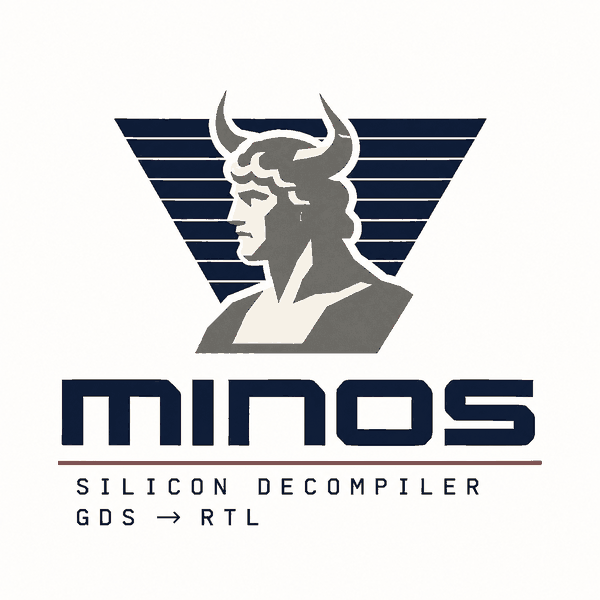

<div align="center">

  

# minos

**A silicon decompiler**

</div>

minos reconstructs RTL from the physical layout of a digital circuit. It can be useful for understanding existing silicon, recovering RTL when the original source is unavailable, and checking recovered designs against the gates they came from.

Given a GDS layout and the PDK used to build it, minos extracts the circuit, identifies its structure, and attempts to recover an equivalent SystemVerilog description. The output is intended to describe the design at the RTL level: registers, buses, arithmetic, and control flow, rather than a gate-level netlist.

Every transformation is checked for equivalence against the extracted circuit. If minos cannot prove that a proposed RTL representation implements the same logic, it does not emit that representation.

The project started with the [Jane Street ASIC puzzle 2026](https://github.com/janestreet/asic-puzzle-2026), which provides a layout and asks the solver to determine what it computes.

<div align="center">

[](LICENSE)

[Getting started](docs/getting-started.md) •
[Against a C decompiler](#against-a-c-decompiler) •
[License](#license)

</div>

> **Under active development.** Interfaces, supported designs, and output quality are still changing.

## Against a C decompiler

A C decompiler reconstructs a higher-level program from a compiled binary. minos performs a similar reconstruction on a digital circuit, but the available information and the guarantees are different.

Both tools climb the same ladder. Status is on one scale: Complete, Validated (the output carries a proof or an exact check against ground truth), Partial, Limited, Preliminary. Figures are measured over the twenty one designs in `work/`.

| Stage           | C decompiler                  | minos                                 | Status                               |
| --------------- | ----------------------------- | ------------------------------------- | ------------------------------------ |
| Read            | Bytes in an ELF               | Polygons in a GDS                     | Complete, 21 of 21 layouts           |
| Decode          | Disassembly, using the ISA    | Geometry to placed cells, using the PDK | Validated against the one reference DEF |
| Primitives      | Instructions                  | Cells, with a Liberty function each   | Complete                             |
| Normalise       | Lift to an IR                 | Technology mapped to generic gates    | Complete                             |
| Aggregates      | Variables and types           | Which bits form one word              | Partial, 94% of register bits        |
| Units           | Functions, from the ABI       | Sections, from net locality           | Preliminary, no ground truth         |
| Known code      | Library signatures            | Match against `common_cells`          | Limited, 1 design of 21              |
| Control         | CFG to `if` and `while`       | FSM to `case`                         | Preliminary, 8 cases in 6 designs    |
| Emit            | C, unverified                 | SystemVerilog, proven                 | Validated, 14 of 21 with no bound    |

The distinction is the last row. A software decompiler generally has to choose a plausible interpretation of the binary and leave validation to the user. minos can instead check each proposed representation against the finite-state circuit it came from. This does not make the reconstruction problem easy. It makes it possible to separate what has been recovered from what has merely been guessed.

The two Preliminary rows are the places a C decompiler leans on conventions that hardware does not have. A binary has a calling convention that marks where a function starts, and a program counter that gives control flow a shape to recover. Synthesis leaves no residue of a module boundary, and a netlist has no program order at all, so control flow becomes an FSM steering multiplexers.

When minos cannot prove a higher-level representation, it leaves the corresponding logic at a lower level. In particular, recovering control flow remains one of the more difficult parts of the process.

## Getting started

See [docs/getting-started.md](docs/getting-started.md) for the complete workflow, including the individual stages, how to run them, and the layout of the repository.

To fetch the dependencies and prepare the example designs:

```bash
make deps
make warmup
```

The warmup design includes a ground-truth implementation that can be used to compare the recovered RTL against the original.

## License

minos is licensed under the Apache License 2.0. See [LICENSE](LICENSE).

The layouts under `gds/` and the submodules under `deps/` retain the licenses of their respective projects.
